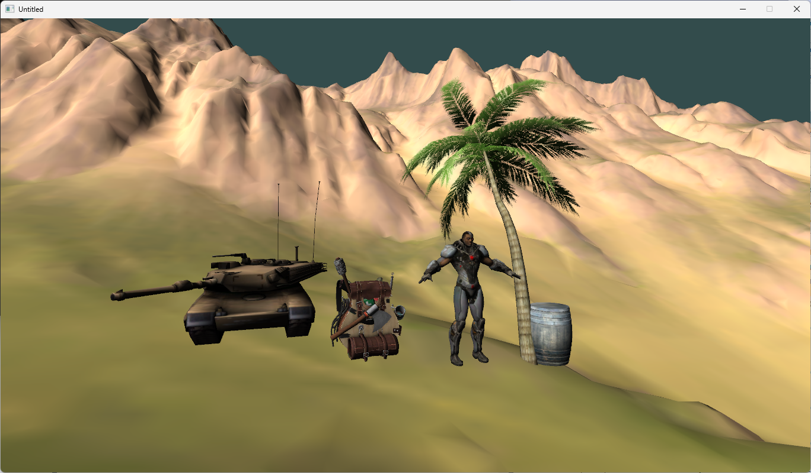

## OpenGL Demo

Features:
* Load 3D models using Assimp
* Custom asset manager for textures, materials, shaders, meshes, scenes
* SDL2 for window creation and input handling
* Phong lighting model
* First person camera movement

## Screenshot

## Control
* **W, A, S, D**: Move camera
* **Shift**: Speed up camera
* **Right Mouse**: Control camera view
* **Left Mouse**: Move forward/backward or turn left/right
